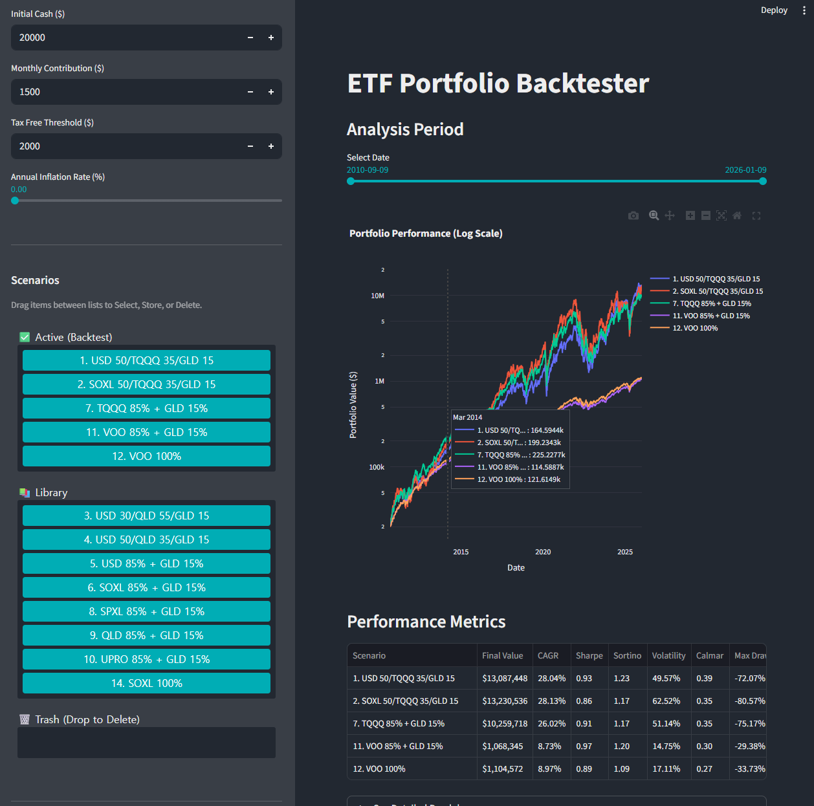

# ETF Portfolio Backtester

Interactive dashboard for backtesting ETF portfolios.

## Usage
Run the application:
```bash
uv run streamlit run main.py
```

## Features
- Compare predefined and custom ETF portfolios
- Interactive performance charts and date filtering
- Drag-and-drop scenario management (Active, Library, Trash)
- Persistent portfolio storage
- Metrics: CAGR, Sharpe, Sortino, Volatility, Calmar, Max Drawdown
- Adjust tax, inflation, and contribution settings

## Image

 