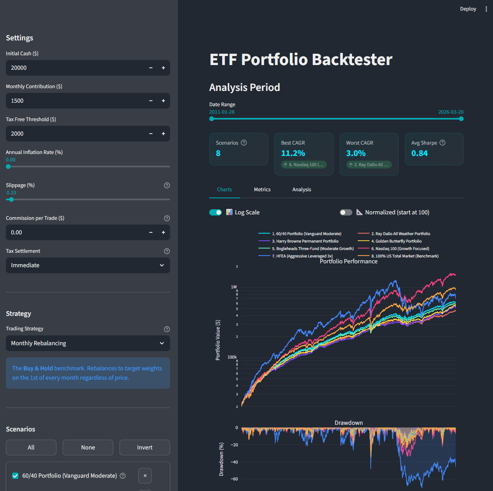
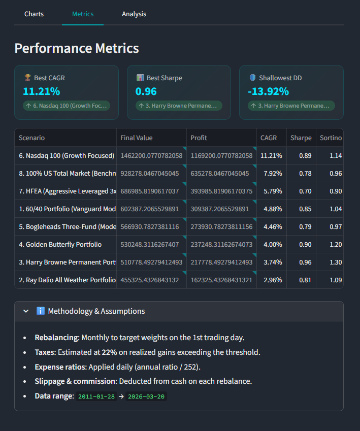
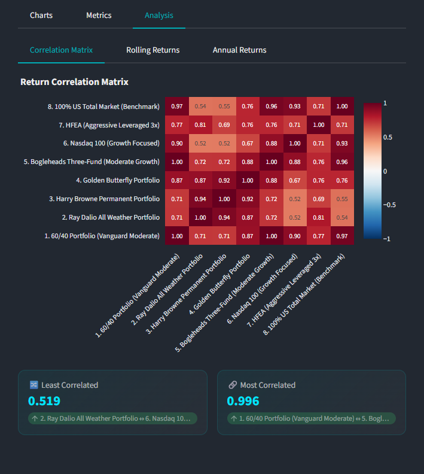
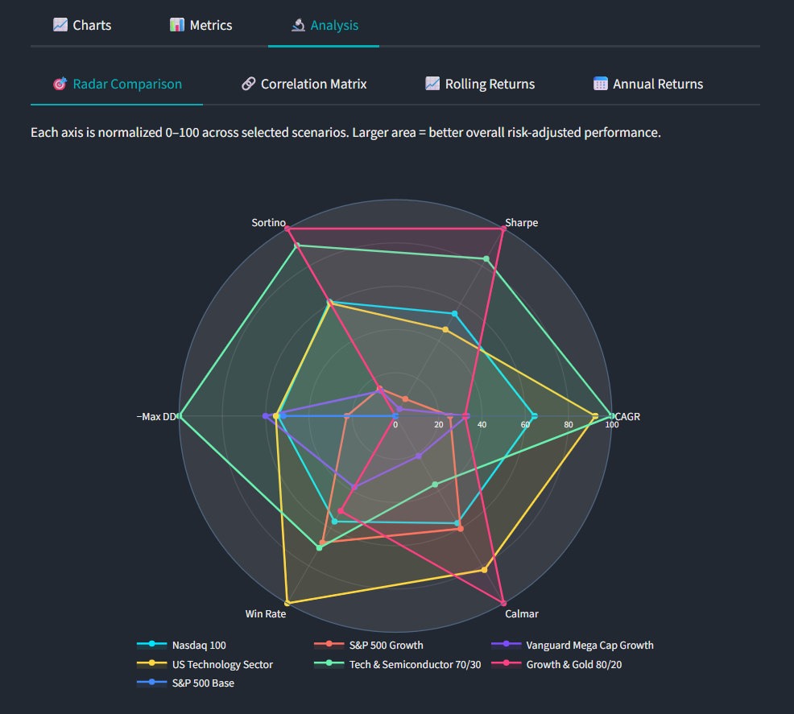
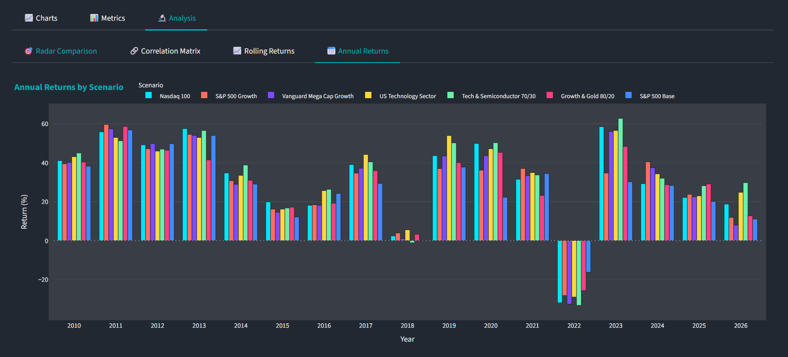

# ETF Portfolio Backtester

Interactive Streamlit dashboard for backtesting ETF portfolios with realistic tax, cost, and strategy simulations.

## Usage

```bash
uv run streamlit run main.py
```

## Features

**Scenarios** -- Create, clone, import/export portfolio scenarios. Each scenario defines a set of tickers with target weights and expense ratios. Select scenarios via checkbox grid with bulk actions (All / None / Invert).

**Strategies** -- 8 built-in signal strategies:
- Monthly Rebalancing (buy-and-hold benchmark)
- Trend Following (SMA)
- SMA Crossover (Golden Cross)
- Volatility Targeting (VIX)
- Trailing Stop (High Water Mark)
- RSI Mean Reversion
- MACD Divergence
- Bollinger Band Squeeze

**Simulation Engine** -- Monthly rebalancing, inflation-adjusted contributions, transaction costs (slippage + commission), and tax logic with immediate or annual settlement modes.

**Analysis Views** -- Results are organized into three tabs:
- **Charts** -- Portfolio performance and drawdown over time, with log-scale and normalized toggles.
- **Metrics** -- Sortable table with CAGR, Sharpe, Sortino, Volatility, Max Drawdown, Calmar, Pain Ratio, Win Rate. Default sorted by CAGR.
- **Analysis** -- Correlation heatmap, rolling returns (1yr / 3yr / 5yr), and annual returns bar chart.

## Screenshots





